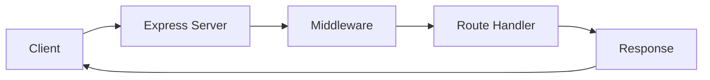

# Express.js Server Documentation

## Table of Contents
- [Basic Server Setup](#basic-server-setup)
- [HTTP Methods](#http-methods)
- [API Endpoints vs Website Endpoints](#endpoints)
- [Middleware](#middleware)

## Basic Server Setup 🚀

Express.js is a minimal and flexible Node.js web application framework. Here's how to set up a basic server:

```javascript
const express = require('express');
const app = express();
const PORT = 8383;

app.listen(PORT, () => {
    console.log(`Server is running on port ${PORT}`);
});
```

### Server Address Details 🌐
- URL: `http://localhost:8383`
- IP Address: `127.0.0.1:8383`
- Port: `8383`

## HTTP Methods 📡

Express.js supports various HTTP methods for handling different types of requests:

| Method  | Purpose | Example Usage |
|---------|---------|---------------|
| GET     | Retrieve data | Fetch user profile |
| POST    | Create new data | Create new account |
| PUT     | Update existing data | Update entire profile |
| PATCH   | Partial update | Update single field |
| DELETE  | Remove data | Delete account |
| OPTIONS | Get resource options | Check available methods |
| HEAD    | Get headers only | Check resource existence |

### Example Code Snippets 💻

#### GET Request
```javascript
app.get('/api/data', (req, res) => {
    console.log("API Endpoint Hit");
    res.send(data);
});
```

#### POST Request
```javascript
app.post('/api/data', (req, res) => {
    const newEntry = req.body;
    console.log("New Entry:", newEntry);
    res.send({ message: "Data received successfully!" });
});
```

## Endpoints Types 🎯

### Website Endpoints (Visual Endpoints)
These endpoints return HTML content and are typically accessed through a browser:

```javascript
app.get('/website', (req, res) => {
    res.send(`<h1>Welcome</h1>`);
});
```

### API Endpoints
These endpoints return data (usually JSON) and are used for programmatic access:

```javascript
app.get('/api/data', (req, res) => {
    res.json({
        name: "John Doe",
        age: 30
    });
});
```

## Middleware ⚙️

Middleware functions are essential for:
- Request processing
- Authentication
- Logging
- Error handling

Example of JSON middleware:
```javascript
app.use(express.json());
```

## Best Practices 📝

1. Always use appropriate HTTP methods
2. Include error handling
3. Use middleware for common tasks
4. Structure your routes logically
5. Use proper status codes

## Request & Response Flow


## Status Codes Quick Reference 📊

| Code | Meaning |
|------|---------|
| 200  | OK |
| 201  | Created |
| 400  | Bad Request |
| 404  | Not Found |
| 500  | Server Error |

---

> 📝 **Note**: This documentation is based on the Express.js server implementation in `server.js`.

For visual representation of the concepts, you can add relevant images in the following locations:
1. Server Architecture: `/images/server-architecture.png`
2. HTTP Methods Flow: `/images/http-methods.png`
3. Middleware Chain: `/images/middleware-chain.png`
