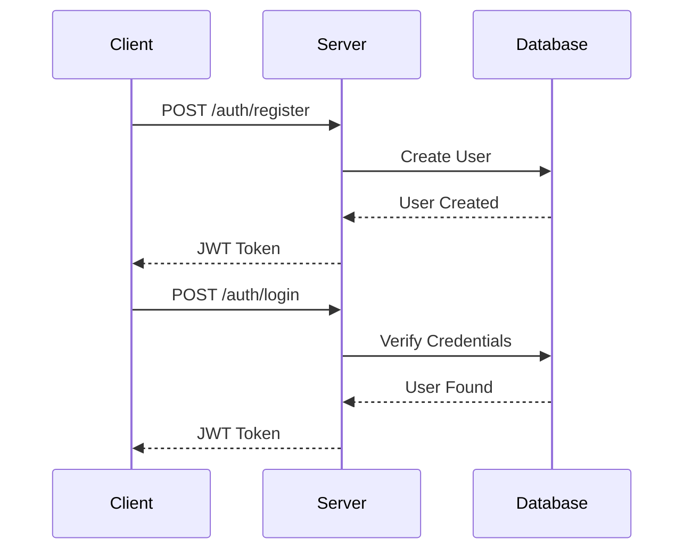

# Full Stack Todo Application Documentation 📝

## Table of Contents
1. [Project Overview](#project-overview)
2. [Technology Stack](#technology-stack)
3. [Project Setup](#project-setup)
4. [Database Design](#database-design)
5. [Authentication](#authentication)
6. [API Endpoints](#api-endpoints)
7. [Frontend Integration](#frontend-integration)

## Project Overview 🎯

A full-stack todo application with user authentication using:
- Node.js (v20+)
- Express.js
- SQLite Database
- JWT Authentication
- Modern ES Modules

## Technology Stack 🛠️

### Backend Technologies
- **Node.js**: Runtime environment (v20.11.1)
- **Express.js**: Web framework (v5.1.0)
- **SQLite**: Database
- **bcryptjs**: Password hashing
- **jsonwebtoken**: Authentication tokens

### Project Structure
```plaintext
Intermediate-Level/
├── src/
│   ├── server.js
│   ├── db.js
│   ├── middleware/
│   │   └── authMiddleware.js
│   └── routes/
│       ├── authRoutes.js
│       └── todoRoutes.js
├── public/
│   ├── index.html
│   ├── styles.css
│   └── fanta.css
└── package.json
```

## Project Setup ⚙️

### 1. Initialize Project
```bash
npm init -y
```

### 2. Configure Package.json for ES Modules
```json
{
  "type": "module",
  "scripts": {
    "dev": "node --watch --env-file=.env --experimental-sqlite --experimental-strip-types ./src/server.js"
  }
}
```

### 3. Install Dependencies
```bash
npm install express bcryptjs jsonwebtoken
npm install nodemon --save-dev
```

## Database Design 💾

### SQLite Schema

```sql
-- Users Table
CREATE TABLE users (
    id INTEGER PRIMARY KEY AUTOINCREMENT,
    username TEXT UNIQUE,
    password TEXT
);

-- Todos Table
CREATE TABLE todos (
    id INTEGER PRIMARY KEY AUTOINCREMENT,
    user_id INTEGER,
    task TEXT,
    completed BOOLEAN DEFAULT 0,
    FOREIGN KEY (user_id) REFERENCES users(id)
);
```

### Database Connection
```javascript
import { DatabaseSync } from 'node:sqlite';
const db = new DatabaseSync(':memory:');
```

## Authentication System 🔐

### JWT Implementation
```javascript
import jwt from 'jsonwebtoken';

// Generate Token
const generateToken = (userId) => {
    return jwt.sign({ id: userId }, process.env.JWT_SECRET, {
        expiresIn: '24h'
    });
};
```

### Authentication Middleware
```javascript
const authMiddleware = async (req, res, next) => {
    try {
        const token = req.headers.authorization;
        const decoded = jwt.verify(token, process.env.JWT_SECRET);
        req.userId = decoded.id;
        next();
    } catch (error) {
        res.status(401).json({ error: 'Unauthorized' });
    }
};
```

## API Endpoints 🌐

### Authentication Routes

| Endpoint | Method | Description |
|----------|---------|------------|
| /auth/register | POST | Create new user |
| /auth/login | POST | Login user |

### Todo Routes

| Endpoint | Method | Description |
|----------|---------|------------|
| /todos | GET | Get all todos |
| /todos | POST | Create todo |
| /todos/:id | PUT | Update todo |
| /todos/:id | DELETE | Delete todo |

## Frontend Integration 🎨

### API Integration Example
```javascript
// Fetch Todos
async function fetchTodos() {
    const response = await fetch('/todos', {
        headers: { 'Authorization': token }
    });
    const data = await response.json();
    return data;
}
```

### Authentication Flow


## Security Best Practices 🛡️

1. Password Hashing
```javascript
const hashedPassword = await bcrypt.hash(password, 10);
```

2. JWT Token Storage
```javascript
localStorage.setItem('token', token);
```

3. Protected Routes
```javascript
app.use('/todos', authMiddleware);
```

## Error Handling 🚨

```javascript
try {
    // Database operations
} catch (error) {
    res.status(500).json({
        error: 'Internal Server Error',
        details: process.env.NODE_ENV === 'development' ? error.message : {}
    });
}
```

## Testing API Endpoints 🧪

### Using REST Client
```http
### Register User
POST http://localhost:5000/auth/register
Content-Type: application/json

{
    "username": "test@example.com",
    "password": "password123"
}

### Login User
POST http://localhost:5000/auth/login
Content-Type: application/json

{
    "username": "test@example.com",
    "password": "password123"
}
```

---

> 💡 **Note**: This documentation is a living document and will be updated as the project evolves.

Images to be added:
1. `/images/project-architecture.png`
2. `/images/auth-flow.png`
3. `/images/api-endpoints.png`
